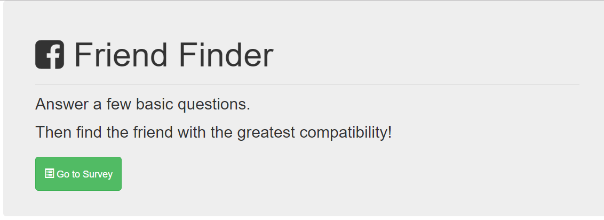
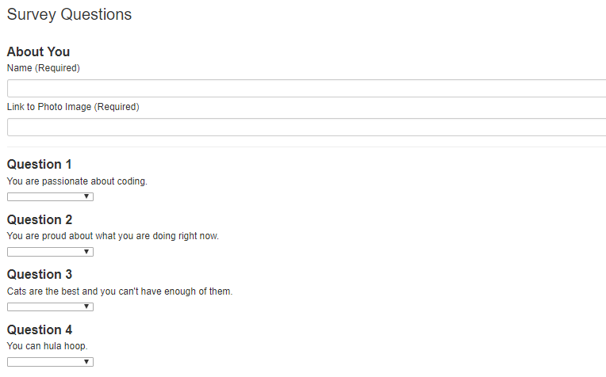

# FriendFinder

## Hosted on Heroku: <a href="https://find-new-friend.herokuapp.com/">Find-New-Friend</a>

 

## Find-New-Friend

An app that allows the user to answer survey questions and be matched to a user that most closely aligns to similar responses. The user does need to include their name and an image of themself to access the game.

## App Design Description

This app was written to show the use of node.js and express.js in surveys. The hardest part of the build was finding out how to access the answers of each user and test them against each other. This was accomplished by using a nested for-loop.

## Find New Friend is a CLI app that incorporates:

## Screenshots

 
